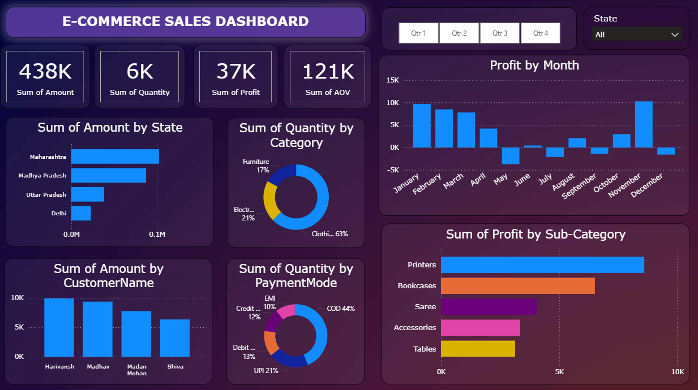

# 📊 Sales Dashboard using Power BI

## 🔍 Project Overview
This project is an interactive **Sales Dashboard** built using **Power BI**, designed to analyze sales performance using Orders and Details datasets.

The dashboard provides insights into revenue trends, order distribution, and category-wise performance to support data-driven decision-making.

---

## 🛠 Tools & Technologies
- Power BI
- Microsoft Excel / CSV
- Data Modeling
- DAX (Basic Measures)

---

## 📁 Dataset
- **Orders.csv** – Order-level sales data
- **Details.csv** – Product and category details

---

## 📈 Dashboard Features
- Total Sales, Profit, and Quantity KPIs
- Monthly and yearly sales trends
- Category-wise and sub-category-wise analysis
- Region-based performance insights
- Interactive slicers and filters

---

## 🖼 Dashboard Preview

---

## 📥 How to Use
1. Download the `.pbix` file from this repository
2. Open it using **Power BI Desktop**
3. Load the provided datasets if prompted

---

## 👤 Author
**Vaziq Ahmed**  
Aspiring Data Analyst | Power BI | Python | SQL
